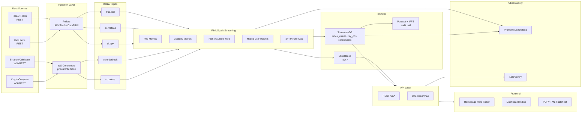

# StableYield Index (SYI) - Production Architecture

## Overview
The StableYield Index is the world's first real-time benchmark for risk-adjusted stablecoin yields. This document outlines the production-grade architecture for institutional deployment.

## Architecture Diagram



## Current Status

### ✅ MVP Implementation (Phase 1)
- **Index Calculation Engine**: Market-cap weighted RAY formula
- **6 Stablecoin Coverage**: USDT, USDC, DAI, TUSD, FRAX, USDP
- **Background Scheduler**: 1-minute updates via APScheduler
- **MongoDB Storage**: Time-series data with indexing
- **REST API**: `/api/index/*` endpoints
- **Frontend**: Live ticker + dashboard
- **Risk Scoring**: Peg stability, liquidity, counterparty analysis

**Current Index Value**: 0.9158% (Risk-Adjusted Yield)

### 🚀 Production Upgrade Path (Phase 2)

## Kafka Topics Configuration

### Core Topics
```yaml
cc.prices:
  key: "{symbol}-{venue}"
  retention: 7d
  compaction: ON
  partitions: 12
  replication: 3

cc.orderbook:
  key: "{symbol}-{venue}"
  retention: 24h
  compaction: OFF
  partitions: 12
  replication: 3

dl.apy:
  key: "{protocol}-{symbol}"
  retention: 30d
  compaction: ON
  partitions: 6
  replication: 3

ex.mktcap:
  key: "{symbol}"
  retention: 30d
  compaction: ON
  partitions: 3
  replication: 3

trad.tbill:
  key: "yield-{maturity}"
  retention: 365d
  compaction: ON
  partitions: 1
  replication: 3
```

## Database Schemas

### TimescaleDB (Primary Time-Series)
```sql
-- Index values (1-minute intervals)
CREATE TABLE index_values (
  timestamp TIMESTAMPTZ NOT NULL,
  index_id VARCHAR(10) NOT NULL,
  value NUMERIC(10,6) NOT NULL,
  methodology_version VARCHAR(10) NOT NULL,
  metadata JSONB,
  PRIMARY KEY (timestamp, index_id)
);

-- RAY observations (per constituent)
CREATE TABLE ray_observations (
  timestamp TIMESTAMPTZ NOT NULL,
  symbol VARCHAR(10) NOT NULL,
  raw_apy NUMERIC(8,4) NOT NULL,
  peg_score NUMERIC(5,4) NOT NULL,
  liquidity_score NUMERIC(5,4) NOT NULL,
  counterparty_score NUMERIC(5,4) NOT NULL,
  ray NUMERIC(8,4) NOT NULL,
  PRIMARY KEY (timestamp, symbol)
);

-- Constituents weights
CREATE TABLE constituents (
  timestamp TIMESTAMPTZ NOT NULL,
  symbol VARCHAR(10) NOT NULL,
  market_cap NUMERIC(15,2) NOT NULL,
  weight NUMERIC(8,6) NOT NULL,
  PRIMARY KEY (timestamp, symbol)
);

-- Create hypertables
SELECT create_hypertable('index_values', 'timestamp');
SELECT create_hypertable('ray_observations', 'timestamp');
SELECT create_hypertable('constituents', 'timestamp');
```

### ClickHouse (Analytics & Raw Data)
```sql
-- Raw price data
CREATE TABLE raw_prices (
  timestamp DateTime64(3),
  symbol String,
  venue String,
  price Float64,
  volume_24h Float64
) ENGINE = MergeTree()
PARTITION BY toYYYYMM(timestamp)
ORDER BY (symbol, venue, timestamp);

-- Raw order book snapshots
CREATE TABLE raw_orderbook (
  timestamp DateTime64(3),
  symbol String,
  venue String,
  bids Array(Tuple(Float64, Float64)),
  asks Array(Tuple(Float64, Float64))
) ENGINE = MergeTree()
PARTITION BY toYYYYMM(timestamp)
ORDER BY (symbol, venue, timestamp);
```

## API Endpoints (v1)

### REST Endpoints
```
GET /v1/index/syi/current
GET /v1/index/syi/history?start=ISO&end=ISO&interval=1m
GET /v1/index/syi/constituents
GET /v1/index/syi/statistics?days=30

GET /v1/ray/current/{symbol}
GET /v1/ray/history/{symbol}?start=ISO&end=ISO

GET /v1/metrics/peg/{symbol}
GET /v1/metrics/liquidity/{symbol}
GET /v1/metrics/risk/{symbol}

GET /v1/risk-premium/current
GET /v1/risk-premium/history
```

### WebSocket Endpoints
```
WS /stream/syi/live
WS /stream/constituents/{symbol}
WS /stream/ray/all
WS /stream/metrics/peg
```

## Observability & SLOs

### Service Level Objectives
```yaml
syi_calculation_latency:
  target: p95 < 5s
  measurement: time from data ingestion to SYI publication

syi_freshness:
  target: < 90s staleness
  measurement: time since last successful calculation

api_availability:
  target: 99.9%
  measurement: successful responses / total requests

data_completeness:
  target: > 95%
  measurement: successful constituent calculations / total expected
```

### Monitoring Stack
- **Metrics**: Prometheus + Grafana
- **Logging**: Loki + Grafana
- **Alerting**: AlertManager
- **APM**: Sentry
- **Uptime**: StatusPage integration

## Implementation Phases

### Phase 1: Foundation ✅
- [x] MVP Index calculation
- [x] Basic REST API
- [x] Frontend integration
- [x] Demo data sources

### Phase 2: Production Data Pipeline 🚧
- [ ] Kafka cluster setup
- [ ] Data ingestion services
- [ ] Flink/Spark streaming jobs
- [ ] TimescaleDB migration
- [ ] WebSocket API

### Phase 3: Advanced Analytics 📋
- [ ] ClickHouse analytics
- [ ] Complex risk models
- [ ] Machine learning insights
- [ ] Regulatory reporting

### Phase 4: Scale & Compliance 📋
- [ ] Multi-region deployment
- [ ] Audit trail (IPFS)
- [ ] SOC2 compliance
- [ ] Disaster recovery

## Migration Strategy

### Current → Production
1. **Parallel deployment**: Run production pipeline alongside demo
2. **Data validation**: Compare outputs for consistency
3. **Gradual switchover**: Route traffic progressively
4. **Monitoring**: Ensure SLOs maintained throughout

### API Versioning
- Current: `/api/index/*` (v0, demo)
- Production: `/v1/index/*` (v1, institutional)
- Backward compatibility maintained for 6 months

## Security & Compliance

### Data Protection
- Encryption at rest (AES-256)
- TLS 1.3 for data in transit
- API authentication (JWT + API keys)
- Rate limiting and DDoS protection

### Regulatory Compliance
- GDPR compliance for EU users
- SOC2 Type II certification
- Audit logs for all data modifications
- Data retention policies per jurisdiction

---

**Current Implementation Status**: Phase 1 Complete ✅
**Next Milestone**: Kafka + TimescaleDB deployment
**Production Target**: Q2 2025

For technical implementation details, see:
- `/backend/services/index_*` - Current MVP implementation
- `/docs/kafka-setup.md` - Kafka deployment guide
- `/docs/timescaledb-migration.md` - Database migration plan